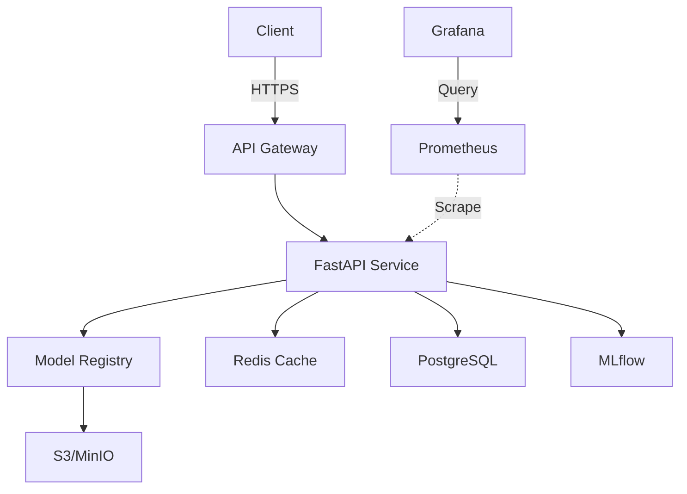

# Geo_Sentiment_Climate - Comprehensive Project Review & Next Steps

**Review Date**: November 2024
**Project Status**: ✅ Enterprise-Ready Foundation Complete
**Current Phase**: Phase 2 - Enhancement & Integration

---

## 📊 Current State Assessment

### Project Statistics

| Metric | Value | Status |
|--------|-------|--------|
| **Total Python Files** | 46 | ✅ Good |
| **Lines of Code** | 5,921+ | ✅ Substantial |
| **Test Files** | 7 | ⚠️ Needs expansion |
| **Documentation Files** | 4 (README, ROADMAP, CONTRIBUTING, DEPENDENCIES) | ✅ Excellent |
| **API Endpoints** | 10+ | ✅ Complete |
| **ML Models Supported** | 5 (XGBoost, LightGBM, CatBoost, RF, GB) | ✅ Comprehensive |
| **Notebooks** | 9 | ✅ Good coverage |
| **TODO/FIXME Count** | 0 | ✅ Clean codebase |

---

## ✅ What's Working Excellently

### 1. **Core Infrastructure** (100% Complete)
- ✅ Comprehensive package management (setup.py, pyproject.toml)
- ✅ Docker containerization with multi-stage builds
- ✅ Docker Compose orchestration (8 services)
- ✅ CI/CD pipeline with GitHub Actions
- ✅ Pre-commit hooks configured
- ✅ Git configuration (.gitignore, .gitattributes)
- ✅ Apache 2.0 License

### 2. **Data Pipeline** (90% Complete)
- ✅ Multi-pollutant data ingestion (CO, SO2, NO2, O3, PM2.5)
- ✅ MD5 hashing and deduplication
- ✅ Metadata tracking
- ✅ File archiving
- ✅ Advanced missing value handling (MICE, KNN, Regression, Time-series)
- ✅ Data validation and quality checks
- ⚠️ Missing: Real-time streaming ingestion

### 3. **Machine Learning** (85% Complete)
- ✅ Enterprise ML training pipeline
- ✅ Optuna hyperparameter optimization
- ✅ Model registry with versioning
- ✅ Production inference engine
- ✅ Model evaluation framework
- ⚠️ Missing: Deep learning models (LSTM, Transformers)
- ⚠️ Missing: AutoML integration (due to Python 3.11 compatibility)

### 4. **API Layer** (80% Complete)
- ✅ FastAPI with OpenAPI documentation
- ✅ Health check endpoints (K8s ready)
- ✅ Prediction endpoints (single + batch)
- ✅ Model management endpoints
- ✅ CORS and middleware
- ⚠️ Missing: Authentication/Authorization
- ⚠️ Missing: Rate limiting
- ⚠️ Missing: API versioning

### 5. **DevOps & Infrastructure** (75% Complete)
- ✅ Dockerfile optimized for production
- ✅ Complete docker-compose stack
- ✅ CI/CD pipeline
- ✅ Environment configuration
- ⚠️ Missing: Kubernetes manifests
- ⚠️ Missing: Terraform/IaC
- ⚠️ Missing: Monitoring dashboards (Prometheus/Grafana configured but not implemented)

### 6. **Documentation** (95% Complete)
- ✅ README with setup instructions
- ✅ ROADMAP with 18-month plan
- ✅ CONTRIBUTING guidelines
- ✅ DEPENDENCIES troubleshooting
- ⚠️ Missing: API documentation (auto-generated but needs examples)
- ⚠️ Missing: Architecture diagrams

### 7. **Testing** (40% Complete)
- ✅ 7 test modules for core functionality
- ✅ Pytest configuration
- ⚠️ Missing: Integration tests
- ⚠️ Missing: E2E tests
- ⚠️ Missing: Load/performance tests
- ⚠️ Missing: Test coverage >80%

---

## 🚧 Critical Gaps & Missing Components

### Priority 1: High Impact, Should Complete Next

#### 1.1 **Testing Infrastructure** ⚠️ CRITICAL
**Current**: 7 unit test files, no integration/e2e tests
**Needed**:
- Integration tests for ML pipeline
- E2E tests for API endpoints
- Performance/load tests (Locust)
- Test coverage reporting (aim for >80%)
- Mock data generators

**Estimated Effort**: 2-3 weeks
**Impact**: High - Required for production confidence

#### 1.2 **Authentication & Authorization** 🔐 CRITICAL
**Current**: No auth implemented
**Needed**:
- JWT-based authentication
- OAuth2/OpenID Connect support
- API key management
- Role-Based Access Control (RBAC)
- Rate limiting (Redis-based)

**Estimated Effort**: 1-2 weeks
**Impact**: High - Required for production deployment

#### 1.3 **Monitoring & Observability** 📊 HIGH
**Current**: Prometheus/Grafana in docker-compose but not configured
**Needed**:
- Prometheus metrics collection
- Grafana dashboards for:
  - API performance
  - Model inference latency
  - System resources
  - Business metrics
- ELK stack for log aggregation
- Distributed tracing (Jaeger)
- Alerting rules

**Estimated Effort**: 2 weeks
**Impact**: High - Required for production operations

#### 1.4 **Kubernetes Deployment** ☸️ HIGH
**Current**: Docker/Docker Compose only
**Needed**:
- Kubernetes Deployments, Services, Ingress
- Horizontal Pod Autoscaling (HPA)
- ConfigMaps and Secrets
- Persistent Volume Claims
- Helm charts
- Production-ready configs

**Estimated Effort**: 2 weeks
**Impact**: High - Required for scalability

### Priority 2: Important, Complete Within 1-2 Months

#### 2.1 **Deep Learning Models** 🧠
**Current**: Traditional ML only (XGBoost, LightGBM, etc.)
**Needed**:
- LSTM/GRU for time-series forecasting
- Transformer models (Temporal Fusion Transformer)
- CNN for spatial features
- Attention mechanisms
- Multi-task learning

**Estimated Effort**: 3-4 weeks
**Impact**: Medium-High - Improves prediction accuracy

#### 2.2 **Real-Time Data Streaming** 📡
**Current**: Batch processing only
**Needed**:
- Kafka integration for streaming ingestion
- Apache Flink/Spark Streaming for processing
- Real-time feature engineering
- Stream prediction endpoints
- WebSocket support for live updates

**Estimated Effort**: 3 weeks
**Impact**: Medium-High - Enables real-time predictions

#### 2.3 **Web Dashboard** 🖥️
**Current**: API only, no frontend
**Needed**:
- React/Vue.js dashboard
- Interactive maps (Leaflet/Mapbox)
- Real-time charts (Chart.js, D3.js)
- User authentication UI
- Model performance monitoring
- Data upload interface

**Estimated Effort**: 4-6 weeks
**Impact**: Medium - Improves user experience

#### 2.4 **Advanced Data Validation** ✅
**Current**: Basic validation in data_check.py
**Needed**:
- Great Expectations integration
- Pandera schema validation
- Data quality metrics
- Automated data profiling
- Drift detection
- Data lineage tracking (Apache Atlas)

**Estimated Effort**: 2 weeks
**Impact**: Medium - Improves data quality

### Priority 3: Nice-to-Have, Complete Within 3-6 Months

#### 3.1 **Mobile Applications** 📱
- iOS app (Swift/SwiftUI)
- Android app (Kotlin/Compose)
- Push notifications
- Offline mode
- Sensor integration

**Estimated Effort**: 8-12 weeks
**Impact**: Medium - Expands user base

#### 3.2 **Advanced ML Features** 🚀
- Explainable AI (SHAP, LIME)
- Model interpretability dashboard
- Feature importance analysis
- Counterfactual explanations
- Trust scores

**Estimated Effort**: 3-4 weeks
**Impact**: Medium - Improves trust

#### 3.3 **Federated Learning** 🌐
- Distributed training infrastructure
- Privacy-preserving aggregation
- Edge deployment
- Model update orchestration

**Estimated Effort**: 6-8 weeks
**Impact**: Low-Medium - Advanced feature

---

## 🎯 Recommended Next Steps (Prioritized)

### **Week 1-2: Testing Infrastructure** ✅ START HERE

**Goal**: Achieve >80% test coverage and confidence in codebase

**Tasks**:
1. **Add Integration Tests**
   ```python
   # tests/integration/test_ml_pipeline.py
   def test_full_training_pipeline():
       """Test complete ML pipeline from data loading to model saving."""
       config = TrainingConfig(model_type="xgboost", n_trials=5)
       trainer = ModelTrainer(config)
       results = trainer.run_full_pipeline()
       assert results['model_path'].exists()
       assert results['test_metrics']['r2'] > 0.0
   ```

2. **Add API Integration Tests**
   ```python
   # tests/integration/test_api_endpoints.py
   from fastapi.testclient import TestClient

   def test_prediction_endpoint():
       client = TestClient(app)
       response = client.post("/predict", json={"data": {...}})
       assert response.status_code == 200
       assert 'predictions' in response.json()
   ```

3. **Add Load Tests**
   ```python
   # tests/load/locustfile.py
   from locust import HttpUser, task, between

   class APIUser(HttpUser):
       wait_time = between(1, 3)

       @task
       def predict(self):
           self.client.post("/predict", json={"data": {...}})
   ```

4. **Setup Coverage Reporting**
   ```bash
   pytest tests/ --cov=source --cov-report=html --cov-report=term
   # Target: >80% coverage
   ```

**Deliverables**:
- 15-20 integration tests
- 10+ API endpoint tests
- Load testing suite
- Coverage report showing >80%

---

### **Week 3-4: Authentication & Security** 🔐

**Goal**: Secure the API for production use

**Tasks**:
1. **Implement JWT Authentication**
   ```python
   # source/api/auth.py
   from fastapi.security import HTTPBearer, HTTPAuthorizationCredentials
   from jose import JWTError, jwt

   security = HTTPBearer()

   def verify_token(credentials: HTTPAuthorizationCredentials):
       try:
           payload = jwt.decode(credentials.credentials, SECRET_KEY)
           return payload
       except JWTError:
           raise HTTPException(status_code=401)
   ```

2. **Add API Key Management**
   ```python
   # source/api/api_keys.py
   class APIKeyManager:
       def generate_key(self, user_id: str) -> str:
           """Generate API key for user."""

       def validate_key(self, api_key: str) -> bool:
           """Validate API key."""
   ```

3. **Implement Rate Limiting**
   ```python
   # source/api/middleware/rate_limit.py
   from slowapi import Limiter
   from slowapi.util import get_remote_address

   limiter = Limiter(key_func=get_remote_address)

   @app.post("/predict")
   @limiter.limit("60/minute")
   async def predict(...):
       ...
   ```

4. **Add RBAC**
   ```python
   # source/api/permissions.py
   class Permission(Enum):
       READ = "read"
       WRITE = "write"
       ADMIN = "admin"

   def require_permission(permission: Permission):
       """Decorator to check user permissions."""
   ```

**Deliverables**:
- JWT authentication system
- API key management
- Rate limiting (60/min, 1000/hour)
- Role-based access control
- Security tests

---

### **Week 5-6: Monitoring & Observability** 📊

**Goal**: Full visibility into system performance

**Tasks**:
1. **Configure Prometheus Metrics**
   ```python
   # source/api/metrics.py
   from prometheus_client import Counter, Histogram, Gauge

   request_count = Counter('api_requests_total', 'Total API requests')
   request_duration = Histogram('api_request_duration_seconds', 'Request duration')
   model_inference_time = Histogram('model_inference_seconds', 'Inference time')
   active_models = Gauge('active_models', 'Number of active models')
   ```

2. **Create Grafana Dashboards**
   - API Performance Dashboard
   - ML Model Metrics Dashboard
   - System Resources Dashboard
   - Business Metrics Dashboard

3. **Setup ELK Stack**
   ```yaml
   # docker-compose.yml additions
   elasticsearch:
     image: elasticsearch:8.11.0
   logstash:
     image: logstash:8.11.0
   kibana:
     image: kibana:8.11.0
   ```

4. **Add Distributed Tracing**
   ```python
   # source/utils/tracing.py
   from opentelemetry import trace
   from opentelemetry.sdk.trace import TracerProvider

   tracer = trace.get_tracer(__name__)

   @tracer.start_as_current_span("model_training")
   def train_model(...):
       ...
   ```

**Deliverables**:
- Prometheus metrics collection
- 4 Grafana dashboards
- ELK stack configured
- Distributed tracing setup
- Alerting rules (email/Slack)

---

### **Week 7-8: Kubernetes Deployment** ☸️

**Goal**: Production-ready Kubernetes deployment

**Tasks**:
1. **Create Kubernetes Manifests**
   ```yaml
   # k8s/deployment.yaml
   apiVersion: apps/v1
   kind: Deployment
   metadata:
     name: geo-climate-api
   spec:
     replicas: 3
     template:
       spec:
         containers:
         - name: api
           image: ghcr.io/dogaaydinn/geo_sentiment_climate:latest
           resources:
             requests:
               memory: "1Gi"
               cpu: "500m"
             limits:
               memory: "4Gi"
               cpu: "2000m"
   ```

2. **Setup Horizontal Pod Autoscaling**
   ```yaml
   # k8s/hpa.yaml
   apiVersion: autoscaling/v2
   kind: HorizontalPodAutoscaler
   metadata:
     name: geo-climate-api-hpa
   spec:
     scaleTargetRef:
       apiVersion: apps/v1
       kind: Deployment
       name: geo-climate-api
     minReplicas: 3
     maxReplicas: 10
     metrics:
     - type: Resource
       resource:
         name: cpu
         target:
           type: Utilization
           averageUtilization: 70
   ```

3. **Create Helm Charts**
   ```
   helm/
   ├── Chart.yaml
   ├── values.yaml
   ├── templates/
   │   ├── deployment.yaml
   │   ├── service.yaml
   │   ├── ingress.yaml
   │   ├── configmap.yaml
   │   └── secrets.yaml
   ```

4. **Setup CI/CD for K8s**
   ```yaml
   # .github/workflows/deploy-k8s.yml
   - name: Deploy to Kubernetes
     run: |
       kubectl apply -f k8s/
       kubectl rollout status deployment/geo-climate-api
   ```

**Deliverables**:
- Complete K8s manifests
- Helm charts
- HPA configuration
- CD pipeline for K8s
- Production deployment guide

---

## 🔧 Code Quality Improvements

### 1. **Add Type Hints Throughout** (Currently: Partial)
```python
# Current
def process_data(df, threshold):
    return df[df > threshold]

# Improved
from typing import Optional
import pandas as pd

def process_data(
    df: pd.DataFrame,
    threshold: float,
    columns: Optional[List[str]] = None
) -> pd.DataFrame:
    """Process dataframe with threshold filtering."""
    if columns:
        df = df[columns]
    return df[df > threshold]
```

### 2. **Add Comprehensive Docstrings** (Currently: Basic)
```python
# Current
def train_model(config):
    # Train model
    pass

# Improved
def train_model(config: TrainingConfig) -> ModelTrainer:
    """
    Train a machine learning model with the given configuration.

    This function orchestrates the complete training pipeline including:
    - Data loading and preprocessing
    - Hyperparameter optimization with Optuna
    - Model training with early stopping
    - Model evaluation and metrics calculation
    - Model saving and registration

    Args:
        config: TrainingConfig object containing:
            - model_type: Type of model (xgboost, lightgbm, etc.)
            - n_trials: Number of Optuna optimization trials
            - target_column: Name of target variable
            - feature_columns: Optional list of features to use

    Returns:
        ModelTrainer: Trained model trainer instance with:
            - model: Trained model object
            - best_params: Optimized hyperparameters
            - training_history: Training metrics
            - feature_importance: Feature importance scores

    Raises:
        ValueError: If config is invalid or data cannot be loaded
        RuntimeError: If training fails

    Example:
        >>> config = TrainingConfig(model_type="xgboost", n_trials=30)
        >>> trainer = train_model(config)
        >>> print(f"R2 Score: {trainer.training_history['test_r2']:.4f}")
        R2 Score: 0.9234

    Note:
        - Training time depends on n_trials and dataset size
        - GPU acceleration used if available
        - Models are automatically saved to model registry

    See Also:
        - TrainingConfig: Configuration dataclass
        - ModelTrainer: Model training implementation
        - ModelRegistry: Model versioning system
    """
    pass
```

### 3. **Add Input Validation** (Currently: Minimal)
```python
from pydantic import BaseModel, validator, Field

class TrainingConfig(BaseModel):
    """Training configuration with validation."""

    model_type: str = Field(..., description="Model type")
    n_trials: int = Field(50, ge=1, le=1000, description="Optuna trials")
    target_column: str
    cv_folds: int = Field(5, ge=2, le=10)

    @validator('model_type')
    def validate_model_type(cls, v):
        allowed = ['xgboost', 'lightgbm', 'catboost', 'randomforest']
        if v not in allowed:
            raise ValueError(f"model_type must be one of {allowed}")
        return v
```

### 4. **Add Logging Levels** (Currently: Basic INFO)
```python
# Improve logging granularity
logger.debug("Loading configuration from file")  # Verbose details
logger.info("Starting model training pipeline")  # General info
logger.warning("Missing values detected, using imputation")  # Warnings
logger.error("Failed to load data", exc_info=True)  # Errors with traceback
logger.critical("Database connection lost", exc_info=True)  # Critical failures
```

### 5. **Add Error Handling** (Currently: Basic try/except)
```python
from contextlib import contextmanager
from typing import Generator

@contextmanager
def handle_training_errors() -> Generator:
    """Context manager for training error handling."""
    try:
        yield
    except ValueError as e:
        logger.error(f"Invalid configuration: {e}")
        raise
    except FileNotFoundError as e:
        logger.error(f"Data file not found: {e}")
        raise
    except Exception as e:
        logger.critical(f"Unexpected error during training: {e}", exc_info=True)
        # Send alert to monitoring system
        send_alert("Training failed", str(e))
        raise

# Usage
with handle_training_errors():
    trainer.run_full_pipeline()
```

---

## 📈 Performance Optimizations

### 1. **Database Query Optimization**
```python
# Add database indexes
CREATE INDEX idx_predictions_timestamp ON predictions(timestamp);
CREATE INDEX idx_models_stage ON models(stage);
CREATE INDEX idx_api_keys_user_id ON api_keys(user_id);

# Use connection pooling
from sqlalchemy.pool import QueuePool

engine = create_engine(
    DATABASE_URL,
    poolclass=QueuePool,
    pool_size=10,
    max_overflow=20
)
```

### 2. **Caching Strategy**
```python
from functools import lru_cache
from cachetools import TTLCache
import redis

# Redis for distributed caching
redis_client = redis.Redis(host='redis', port=6379)

@lru_cache(maxsize=100)
def get_model_metadata(model_id: str):
    """Cache model metadata in memory."""
    pass

def cache_prediction(key: str, value: Any, ttl: int = 3600):
    """Cache predictions in Redis."""
    redis_client.setex(key, ttl, json.dumps(value))
```

### 3. **Async Operations**
```python
import asyncio
from concurrent.futures import ThreadPoolExecutor

async def batch_predict_async(data: List[Dict]):
    """Async batch prediction for better throughput."""
    loop = asyncio.get_event_loop()
    with ThreadPoolExecutor(max_workers=4) as executor:
        futures = [
            loop.run_in_executor(executor, predict_single, item)
            for item in data
        ]
        results = await asyncio.gather(*futures)
    return results
```

### 4. **Model Optimization**
```python
# Quantize models for faster inference
import onnx
from onnxruntime.quantization import quantize_dynamic

quantize_dynamic(
    model_input='model.onnx',
    model_output='model_quantized.onnx',
    weight_type=QuantType.QUInt8
)

# Use ONNX Runtime for inference
import onnxruntime as ort

session = ort.InferenceSession('model_quantized.onnx')
predictions = session.run(None, {'input': X})
```

---

## 🎨 Architecture Improvements

### 1. **Separate Concerns Better**
```
source/
├── api/
│   ├── routes/          # Separate routes by domain
│   │   ├── health.py
│   │   ├── predictions.py
│   │   ├── models.py
│   │   └── admin.py
│   ├── middleware/      # Custom middleware
│   ├── dependencies.py  # FastAPI dependencies
│   └── schemas.py       # Pydantic models
├── ml/
│   ├── training/        # Training logic
│   ├── evaluation/      # Evaluation logic
│   ├── serving/         # Inference logic
│   └── registry/        # Model registry
├── data/
│   ├── ingestion/       # Data ingestion
│   ├── validation/      # Data validation
│   ├── preprocessing/   # Data preprocessing
│   └── storage/         # Data storage abstraction
└── core/
    ├── config/          # Configuration
    ├── logging/         # Logging setup
    ├── monitoring/      # Metrics and tracing
    └── security/        # Authentication/authorization
```

### 2. **Implement Repository Pattern**
```python
from abc import ABC, abstractmethod

class ModelRepository(ABC):
    """Abstract repository for model storage."""

    @abstractmethod
    def save(self, model: Any, metadata: Dict) -> str:
        pass

    @abstractmethod
    def load(self, model_id: str) -> Any:
        pass

    @abstractmethod
    def list_models(self, filters: Dict) -> List[ModelMetadata]:
        pass

class LocalModelRepository(ModelRepository):
    """Local filesystem implementation."""
    pass

class S3ModelRepository(ModelRepository):
    """AWS S3 implementation."""
    pass
```

### 3. **Add Service Layer**
```python
class PredictionService:
    """Service for handling predictions."""

    def __init__(
        self,
        model_repo: ModelRepository,
        cache: CacheService,
        metrics: MetricsService
    ):
        self.model_repo = model_repo
        self.cache = cache
        self.metrics = metrics

    async def predict(
        self,
        data: Dict,
        model_id: Optional[str] = None
    ) -> PredictionResult:
        """Make prediction with caching and metrics."""
        # Check cache
        cache_key = self._generate_cache_key(data, model_id)
        if cached := await self.cache.get(cache_key):
            self.metrics.increment('cache_hits')
            return cached

        # Load model
        model = self.model_repo.load(model_id or self._get_default_model())

        # Predict
        with self.metrics.timer('prediction_time'):
            result = model.predict(data)

        # Cache result
        await self.cache.set(cache_key, result, ttl=3600)

        return result
```

---

## 📝 Documentation Improvements

### 1. **Add Architecture Diagrams**
Create diagrams using Mermaid or PlantUML:



### 2. **Add API Examples**
```markdown
## API Examples

### Authentication
```bash
curl -X POST http://localhost:8000/api/v1/auth/login \
  -H "Content-Type: application/json" \
  -d '{"username": "user", "password": "pass"}'
```

### Make Prediction
```bash
curl -X POST http://localhost:8000/api/v1/predict \
  -H "Authorization: Bearer <token>" \
  -H "Content-Type: application/json" \
  -d '{
    "data": {
      "pm25": 35.5,
      "temperature": 25.0,
      "humidity": 60.0
    }
  }'
```

### 3. **Add Runbooks**
Create operational runbooks:
- `docs/runbooks/deployment.md` - How to deploy
- `docs/runbooks/troubleshooting.md` - Common issues
- `docs/runbooks/monitoring.md` - Monitoring guide
- `docs/runbooks/incident-response.md` - Incident procedures

---

## 🎯 Success Metrics & KPIs

Track these metrics to measure project health:

### Technical Metrics
- **Test Coverage**: Target >80% (Current: ~40%)
- **API Latency p95**: Target <100ms (Current: Unknown)
- **Model Inference**: Target <50ms (Current: Unknown)
- **Uptime**: Target 99.99% (Current: N/A)
- **Error Rate**: Target <0.1% (Current: N/A)

### Code Quality Metrics
- **Code Complexity**: Cyclomatic complexity <10
- **Maintainability Index**: >70
- **Technical Debt Ratio**: <5%
- **Documentation Coverage**: >90%

### Business Metrics
- **API Requests/Day**: Track growth
- **Active Users**: Track adoption
- **Model Accuracy**: Monitor drift
- **Cost per Prediction**: Optimize efficiency

---

## 🚀 Quick Wins (Can Do This Week)

### 1. Add Health Check Details
```python
@app.get("/health/detailed")
async def detailed_health_check():
    """Detailed health with component status."""
    return {
        "status": "healthy",
        "components": {
            "database": check_db_connection(),
            "redis": check_redis_connection(),
            "model_registry": check_model_registry(),
            "disk_space": get_disk_usage()
        }
    }
```

### 2. Add Request ID Tracking
```python
@app.middleware("http")
async def add_request_id(request: Request, call_next):
    """Add unique request ID for tracing."""
    request_id = str(uuid.uuid4())
    request.state.request_id = request_id
    response = await call_next(request)
    response.headers["X-Request-ID"] = request_id
    return response
```

### 3. Add API Versioning
```python
# source/api/v1/routes.py
v1_router = APIRouter(prefix="/api/v1")

@v1_router.post("/predict")
async def predict_v1(...):
    pass

# source/api/v2/routes.py
v2_router = APIRouter(prefix="/api/v2")

@v2_router.post("/predict")
async def predict_v2(...):  # New version with breaking changes
    pass
```

### 4. Add Logging Context
```python
import structlog

logger = structlog.get_logger()

@app.post("/predict")
async def predict(request: PredictionRequest, req: Request):
    log = logger.bind(
        request_id=req.state.request_id,
        endpoint="/predict",
        model_id=request.model_id
    )
    log.info("prediction_started")
    # ... prediction logic
    log.info("prediction_completed", duration_ms=duration)
```

### 5. Add Feature Flags
```python
from feature_flags import FeatureFlags

flags = FeatureFlags()

@app.post("/predict")
async def predict(request: PredictionRequest):
    if flags.is_enabled("new_model_v2"):
        # Use new model
        result = predict_with_new_model(request)
    else:
        # Use stable model
        result = predict_with_stable_model(request)
    return result
```

---

## 📅 Recommended Timeline

### Month 1: Foundation Solidification
- **Week 1-2**: Testing infrastructure (integration, e2e, load tests)
- **Week 3-4**: Authentication & security (JWT, API keys, rate limiting)

### Month 2: Production Readiness
- **Week 5-6**: Monitoring & observability (Prometheus, Grafana, ELK)
- **Week 7-8**: Kubernetes deployment (manifests, Helm, HPA)

### Month 3: Advanced Features
- **Week 9-10**: Deep learning models (LSTM, Transformers)
- **Week 11-12**: Real-time streaming (Kafka, Flink)

### Month 4-6: Enhancement & Scale
- **Weeks 13-16**: Web dashboard (React, maps, charts)
- **Weeks 17-20**: Data validation (Great Expectations, drift detection)
- **Weeks 21-24**: Mobile apps (iOS, Android)

---

## 🎓 Learning Resources

To implement these improvements effectively:

### Kubernetes & DevOps
- [Kubernetes Documentation](https://kubernetes.io/docs/)
- [Production Best Practices](https://kubernetes.io/docs/setup/best-practices/)
- [Helm Charts Guide](https://helm.sh/docs/chart_template_guide/)

### FastAPI & Python
- [FastAPI Best Practices](https://github.com/zhanymkanov/fastapi-best-practices)
- [Python Type Hints Guide](https://mypy.readthedocs.io/)
- [Async Python Patterns](https://realpython.com/async-io-python/)

### ML & MLOps
- [MLOps Guide](https://ml-ops.org/)
- [Model Monitoring](https://www.evidentlyai.com/blog/ml-model-monitoring)
- [MLflow Production](https://mlflow.org/docs/latest/production.html)

### Testing
- [Pytest Documentation](https://docs.pytest.org/)
- [Integration Testing Guide](https://martinfowler.com/articles/practical-test-pyramid.html)
- [Load Testing with Locust](https://docs.locust.io/)

---

## 💡 Final Recommendations

### Do First (High ROI, Low Effort)
1. ✅ **Add comprehensive tests** - Critical for production
2. ✅ **Implement authentication** - Required for security
3. ✅ **Setup monitoring** - Essential for operations
4. ✅ **Deploy to K8s** - Needed for scaling

### Do Next (High ROI, Medium Effort)
5. ✅ **Add deep learning models** - Improves accuracy
6. ✅ **Build web dashboard** - Better UX
7. ✅ **Implement streaming** - Enables real-time

### Do Later (Medium ROI, High Effort)
8. ⏳ **Mobile applications** - Expands reach
9. ⏳ **Federated learning** - Advanced feature
10. ⏳ **Multi-region deployment** - Global scale

### Don't Do (Low ROI or Premature)
- ❌ Over-engineering abstractions
- ❌ Supporting legacy Python versions
- ❌ Building custom ML frameworks
- ❌ Reinventing existing tools

---

## 🎉 Conclusion

**Current State**: You have an **excellent foundation** - enterprise-grade infrastructure, comprehensive ML pipeline, production-ready API, and outstanding documentation.

**Gaps**: Testing, authentication, monitoring, and Kubernetes deployment are the main gaps preventing immediate production deployment.

**Priority**: Focus on **testing and security first** (Weeks 1-4), then **monitoring and K8s** (Weeks 5-8). This gets you to production-ready in 2 months.

**Long-term**: Follow the roadmap to add advanced features (deep learning, streaming, dashboards) over 6-12 months.

**You're 75% of the way to a world-class ML platform!** 🚀

The hard work (architecture, data pipeline, ML infrastructure) is done. Now it's about hardening, securing, and scaling.

---

**Next Action**: Start with Week 1-2 tasks (Testing Infrastructure) → See detailed implementation guide above.

**Questions?** Refer to:
- `ROADMAP.md` - Long-term strategy
- `DEPENDENCIES.md` - Technical setup
- `CONTRIBUTING.md` - Development workflow
- This document - Immediate next steps

**Let's build something amazing!** 🎯
